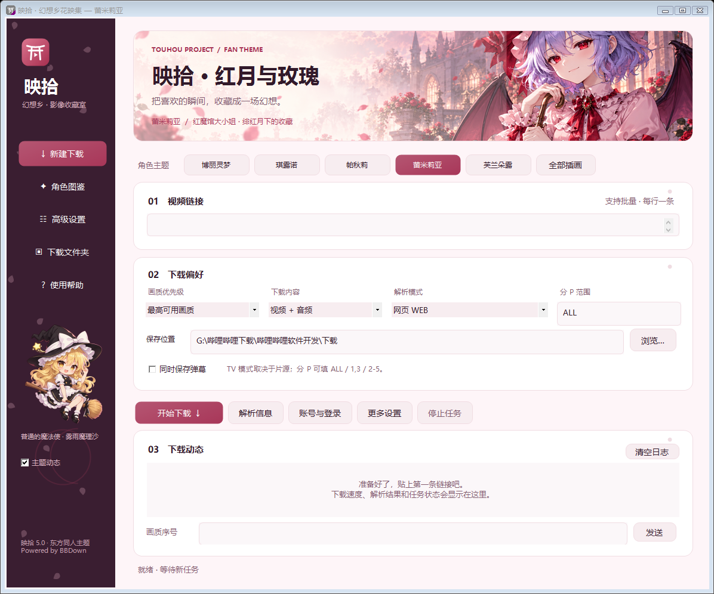
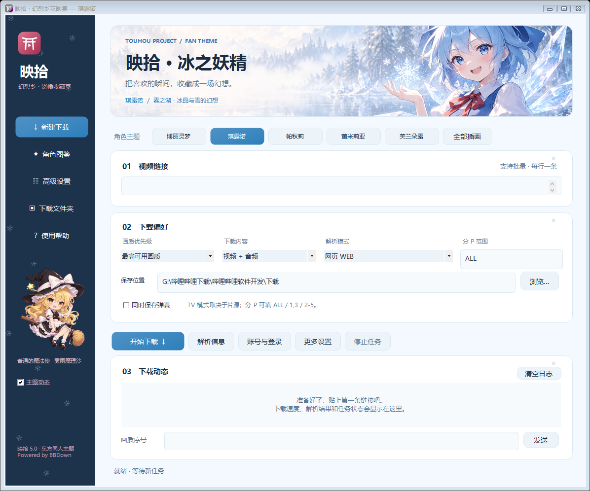

# 映拾 · 幻想乡花映集

Windows 桌面视频下载工具，使用 BBDown 作为下载核心。以东方 Project 同人角色主题装饰界面，支持切换角色主视觉、配色与动态效果。



## 功能

- 批量输入视频链接、BV / av / ep / ss 编号。
- 网页、TV、APP、国际版解析，画质与编码优先级、分 P 选择。
- 视频、音频、字幕、弹幕、封面下载，网页与 TV 扫码登录。
- 全部高级选项、交互式选择音视频流、实时日志与停止任务。
- 灵梦、琪露诺、帕秋莉、蕾米莉亚、芙兰朵露五套主题，魔理沙侧栏角色。
- 角色图鉴、主题记忆、可关闭的樱花 / 雪花 / 魔法光点 / 水晶动态。

**TV 模式是尝试获取不同片源，不是擦除视频画面水印的功能。** 画质、内容范围和片源以视频及账号实际可用权限为准。



## 构建与运行

适用于安装了 .NET Framework 4.x 的 Windows；不需要安装第三方界面框架。

1. 下载或克隆本仓库。
2. 在项目目录执行 `powershell -ExecutionPolicy Bypass -File .\build.ps1`。
3. 界面程序生成在 `dist\映拾花映集.exe`。
4. 从 [BBDown 原项目](https://github.com/nilaoda/BBDown) 准备 `BBDown.exe`，放入 `dist`。此界面按 BBDown 1.6.3 的参数实现。
5. 准备可正常运行的 [FFmpeg](https://ffmpeg.org/download.html)，同样放入 `dist`；若使用 shared 构建，必须一并放入其所需 DLL。
6. 双击界面程序即可使用。

MP4Box 与 aria2 是可选组件，在高级设置中选择程序路径即可。仓库不提供或自动下载第三方可执行文件。

## 项目结构

```text
src/             Windows Forms 界面与下载进程管理源码
assets/          角色主题插画、界面截图与素材说明
build.ps1        本地编译脚本
LICENSE          本项目代码的 MIT 许可证
BBDown-LICENSE.txt
THIRD-PARTY-NOTICES.md
```

## 来源与许可证

本仓库的桌面界面、主题切换和进程管理代码使用 MIT 许可证，**该许可证不覆盖东方角色插画、BBDown、FFmpeg 或其他第三方组件**。

- 下载核心：[BBDown](https://github.com/nilaoda/BBDown)，作者 nilaoda，MIT；保留原版权与许可声明。
- 音视频处理：[FFmpeg](https://ffmpeg.org/)，依具体构建适用 LGPL / GPL。分发其二进制时需落实对应许可、对应源码及其他要求。
- 东方 Project 原作：上海爱丽丝幻乐团 / ZUN。本项目角色主题是同人设计，非官方产品。
- 插画使用 AI 工具辅助生成，未使用官方游戏提取素材。角色及原作权利属于原权利人。参见 [东方同人创作指南](https://touhou-project.news/guidelines_en/) 与 [素材说明](assets/README.md)。

代码及插画在开发过程中使用 AI 辅助生成和迭代。本仓库是桌面界面项目，不声称 BBDown 或 FFmpeg 的解析、下载、合并能力为本项目原创。

## 隐私与使用

Cookie、手动访问令牌仅保留于本次界面运行中。BBDown 自身可能在程序目录保存扫码登录凭据。不要提交登录文件、账号凭据、下载内容或调试日志。

高级设置目前仅保留至程序关闭；保存位置与角色主题会记住。下载功能依赖 BBDown 和平台接口，接口变化可能导致部分功能失效。

请仅下载有权访问和保存的内容，遵守相关内容授权与平台规则。
